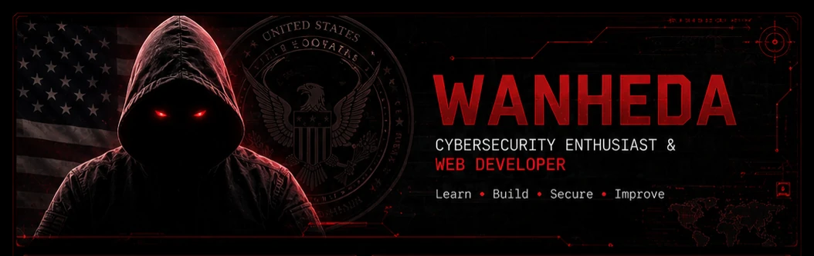

  

<!-- Banner / Header -->
<h1 align="center">Hi, I'm Wanheda 👋</h1>
<h3 align="center">Cybersecurity Enthusiast • Web Developer • Backend Builder • Malware Research Explorer</h3>

  
  
  
  

---

## 👨‍💻 About Me

I’m **Wanheda**, a cybersecurity enthusiast and web developer focused on **secure systems**, **network technologies**, and **backend development**.

My curiosity is driven by one core question:

> **How do systems work, how do they fail, and how do we build them better?**

I love digging into the structure of software, understanding attack surfaces, studying defensive mechanisms, and building tools that are **fast, practical, and security-focused**.

My current focus includes:

- analyzing how malware works
- understanding file-based propagation and infection patterns
- studying how viruses cause damage and persist
- exploring spyware behavior and building defenses against it
- developing tooling in **Go**, **TypeScript**, and **Node.js**
- improving secure backend design and network security knowledge

---

## 🧠 What I’m Into

- **Cybersecurity**
  - malware analysis
  - defensive engineering
  - network security
  - secure architecture
  - threat understanding
- **Web Development**
  - backend systems
  - API design
  - modern frontend workflows
- **Low-Level / Systems Thinking**
  - memory, processes, execution flow
  - file behavior and persistence
  - system internals
- **Automation & Tooling**
  - scripting
  - security utilities
  - workflow optimization

---

## ⚙️ Tech Stack

### 🧩 Languages

  
  
  
  
  

### 🎨 Frontend

  
  
  
  
  

### 🛠 Backend

  
  

### 🧰 Tools & Environments

  
  
  
  
  
  
  
  
  

---

## 🔥 Current Focus

Right now I’m deeply focused on:

- **How malware spreads through files and systems**
- **How viruses execute, replicate, and damage environments**
- **Spyware behavior, detection, and defense**
- **Go development for secure and efficient tools**
- **TypeScript + Node.js for modern backend systems**
- **Building secure-by-design applications**
- **Studying network technologies and traffic behavior**

---

## 🚀 Goals

- Build **production-grade cybersecurity tools**
- Improve my **network security** knowledge
- Contribute to **open-source** projects
- Expand expertise in **Go** and **system programming**
- Learn how to **build secure systems**, **improve detection**, and **ship useful tools**
- Keep leveling up in both **offensive understanding** and **defensive engineering**

---

## 🧪 My Philosophy

> **Learn. Build. Secure. Improve.**

I believe the strongest engineers are the ones who understand both:
- **how to create systems**
- **and how those systems can be attacked**

That’s why I like working on security from both sides:
- exploring attack patterns
- understanding real-world weaknesses
- designing stronger defenses
- turning knowledge into practical tools

---

## 🧩 Fun Facts

- I like **debugging** almost as much as building.
- I use **Linux** because I enjoy control, flexibility, and speed.
- I keep **Windows** around... mostly for fun 😂
- I enjoy exploring the internals of software, not just the surface.
- I like turning complicated systems into understandable pieces.

---

## 📬 Contact

- GitHub: `https://github.com/ItsWaneda`
- Email: `wanheda.work@gmail.com`

---

  <b>“Learn. Build. Secure. Improve.”</b>

